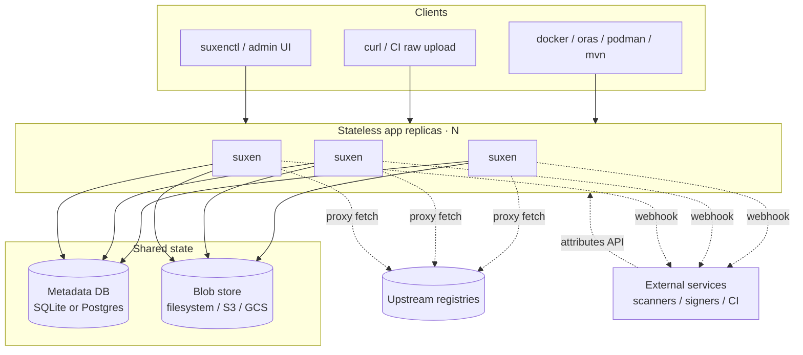

# Architecture

This document describes how suxen is built: its design principles, domain model, runtime
shape, and the internal seams a contributor needs to understand before changing the core.
Product positioning lives in the root [README](../../README.md); public contracts (API, CLI,
configuration, compatibility) live in the [documentation set](../README.md) and take
precedence over this document wherever they overlap.

## Design principles

suxen is a small, horizontally scalable artifact repository — a deliberately
stripped-down homage to Sonatype Nexus Repository, hence the reversed name. A handful of
principles drive every structural decision:

1. **Content-addressed storage.** Artifact bytes are immutable blobs keyed by their
   digest. Equal bytes share an identity, enabling deduplication and repeatable
   writes. Publication and reclamation still require coordination across replicas.
2. **Stateless application tier.** In a cluster, durable state lives in a shared
   metadata database and blob store. Replicas hold no authoritative local state in the
   supported clustered topology. Scale in after draining traffic; in-flight
   requests may need retry, and the remaining replicas and shared backends must
   stay available.
3. **Small footprint.** A single static binary with sub-second start and a low idle
   memory profile. One process plus SQLite plus a local directory is a complete install.
4. **Cloud-native operations.** First-class container image and Helm chart, health and
   readiness probes, Prometheus metrics, and 12-factor configuration.
5. **Extend without forking.** Compile-time service-provider interfaces for the hot-path
   internals (blob stores, repository formats) and loosely coupled webhooks plus external
   attributes for runtime augmentation.

## Domain model

The vocabulary is borrowed from Nexus because it is good and familiar.

```
BlobStore ──< Repository ──< Asset ──> Blob
                  │              │
                  │         Attribute(s)  ── namespaced KV written by verifiers/services
                  └── config (type, format, upstream, policies, cleanup, trust)
```

- **Blob** — an immutable byte sequence identified by its digest (`sha256:…`). Stored
  once per blob store regardless of how many assets reference it. Never mutated; only
  created, or deleted during garbage collection.
- **Asset** — a named, addressable file within a repository (an OCI layer or manifest, a
  raw file at a path). It points at exactly one blob and carries access metadata
  (created, last modified, last downloaded, size, content type) and format attributes.
  Signatures and attestations are themselves assets, attached to a subject via referrers.
- **Component** — a derived grouping of assets that share an identity or version (an OCI
  image `name:tag`, a Maven GAV, the subject of `component.created` webhooks). It is not a
  stored type. Classification labels and some webhook events are computed from this
  grouping.
- **Attribute** — namespaced key/value metadata attached to an asset (and, for policy
  projection, rolled up to the logical component). Attributes are strongly consistent,
  visible cluster-wide, and are the shared input that policies read (see
  [Policies](#policies-classification-cleanup-gates-provenance)).
- **Repository** — a named endpoint with a `format`, a `type`, a bound blob store, and
  type-specific configuration (proxy upstream, group members, policy references, trust
  policy, format configuration).
- **BlobStore** — a physical backend where blobs live. Several repositories may share one
  blob store, which is what enables cross-repository deduplication.

Because blobs are keyed by digest and immutable, two nodes uploading the same layer
target the same key. Database-backed operation leases serialize publication,
migration, and garbage collection for each physical store; proxy cache generations
keep older fetches from replacing newer results. The metadata database coordinates
these operations, while blob storage must provide durable, visible writes.

## Runtime architecture



**Read path (for example `docker pull`):** any replica accepts the request; the repository
resolves (a group walks its members in order, a proxy checks local metadata and falls back
to the upstream); a metadata lookup yields the blob digest; bytes stream from the shared
blob store; access telemetry (`last downloaded`) is updated off the hot path.

**Write path (for example `docker push`):** blob uploads land in the blob store keyed by
digest and verified on write, so concurrent identical pushes converge idempotently. Once
every referenced blob exists, the manifest or metadata is committed to the database in a
transaction — the single strongly consistent "make it visible" step. Post-commit, an
upload event is enqueued for webhook delivery.

The coordination surface is intentionally small: stateless replicas share one database
and shared blob stores. Scheduled singleton jobs use leader leases. Publication,
blob-store migration, and garbage collection use renewable operation leases per
physical store so they cannot race over bytes or metadata (see
[Metadata and clustering](#metadata-and-clustering)).

OCI repositories may also bind extra registry roots by hostname or listen port. Extra
ports serve only `/v2` and probes on that socket. Hostname routing is shared metadata
and is the HA model; extra ports are bound per process.

## Repository formats and types

Format and type are orthogonal for the core formats and the Maven, Go, Cargo, npm, and
PyPI plugins, which support every type. Only git restricts type — it is proxy-only, and
its `ValidateRepository` rejects the rest.

**Formats.** `raw` (arbitrary files addressed by path) and `oci` (the OCI Distribution v2
API, including the referrers API used for signatures and attestations) are built into the
server core. `oci` lives in its own package (`internal/oci`) but stays core because it
owns native OCI host and port routing outside the format SPI: on the generic
listener it is `/repository/{name}/v2/…`; on a bound host or extra port it is native
`/v2/…`. Additional formats — Maven, Go modules, Cargo, npm, PyPI, and git in the
default build — are supplied through the public format SPI. See the
[extension guide](extending.md) for the SPI contract and build tags.

**Types.**

- **Hosted** — authoritative storage you push to. Reads serve local assets; deletes are
  subject to access control and cleanup.
- **Proxy** — a pull-through cache of a single upstream. On a miss it stages and verifies
  the complete upstream response before exposing the cached asset; it supports
  negative caching and per-proxy upstream authentication.
- **Group** — a virtual, read-only union that fans a request across an ordered list of
  members of the same format and returns the first hit. It stores nothing of its own.

A proxy cache fill on one node is immediately visible to another because the blob is in the
shared store and the asset row is in the shared database — there is no cross-node cache
invalidation protocol.

Native package publication validates and stages the complete request, then commits the
payload and its version metadata in one metadata transaction. Package-version paths are
immutable by default: an idempotent retry with the same digest succeeds, while a different
digest at the same version conflicts. Administrators can explicitly permit replacement
with the hosted repository's `allowOverwrite` setting, enforced in the publication
transaction. The same setting can protect raw paths, Maven/Go artifacts, and OCI tags. Mutable proxy indexes opt into replacement explicitly.

## Blob storage

A blob store is addressed entirely by digest. The `fs` (sharded local filesystem) and `s3`
(S3-compatible object storage) drivers are built into the core; `gcs` ships as a plugin in
the default build, and third-party drivers register through the public blob SPI. A driver
declares its capabilities — its URL scheme and whether it is shared storage safe for
multi-node use — so cluster-safety gating and configuration validation derive from the
driver rather than from string-matching a scheme.

Deduplication and integrity fall out of content-addressing: identical bytes are stored once
per store, and every write is verified against the digest key before the blob becomes
visible. Garbage collection is a
leader-gated mark-and-sweep that enumerates referenced digests and deletes unreferenced
blobs older than a grace period; it runs on its own schedule, independent of cleanup
selection, so disabling cleanup never disables reclamation.

## Metadata and clustering

The application tier is stateless in the clustered topology. The metadata database
coordinates writes and leases, while the shared blob store must meet the driver's
atomic publication and visibility requirements. The two shipped metadata backends are:

- **SQLite** — the single-node and development path: one binary, one file, no external
  services.
- **PostgreSQL** — the highly available path: stateless replicas point at one Postgres,
  whose HA is delegated to a managed service or a bundled operator rather than reinvented.

Both backends share one `SQLStore` implementation; Postgres embeds it instead of carrying a
second copy of the SQL.

Metadata writes (manifest commits, access-control changes, repository configuration,
attributes) are strongly consistent, giving read-your-writes for push-then-pull, permission
changes, and quarantine gates. Blob bytes are immutable, but publication and deletion
are serialized by store operation leases. Hot-path telemetry such as `last downloaded`
is best-effort. Content update, upstream validation, annotation changes, and
download access have separate timestamps.

Schema changes are applied by ordered, checksummed, dialect-split migrations with advisory
locking on Postgres, so SQLite and Postgres stay in lockstep. Scheduled singletons (cleanup,
garbage collection, provisioning) run on exactly one node, gated by a renewable leader lease
in the database; on SQLite the single node is always the leader. Separately, publication,
migration, and garbage collection acquire renewable database-backed operation leases for
the physical stores they touch. Multi-store operations acquire leases in name order;
they recheck current metadata after acquisition before copying or deleting blobs.

### Format capabilities

`ProxyRequestResolver` resolves validation, cache identity, and upstream target
once for a generic proxy read. Independent path policy, authorization, and
download gates still apply.
The [extension guide](extending.md) documents the hook contracts and defaults.

`RetentionGrouping` supplies grouping keys and exclusively owned metadata paths.
Cargo and npm supply their coordinate knowledge; deletion, transactions, events,
and accounting remain host-owned. Retention counts asset rows. Publish an
artifact and its companions together through `WireTools.StoreAssets`.

## Policies: classification, cleanup, gates, provenance

suxen's policy subsystems share one model: **attributes are the blackboard; classifiers and
verifiers write it; predicates read it.**

- **Classification** evaluates ordered rules over a component's coordinate and stores the
  resulting label, so downstream policies and queries never re-evaluate a regular
  expression.
- **Predicates** are the typed selection language — a path into the projected attribute
  view, an operator, and a value — evaluated with typed comparison. Cleanup policies and
  download gates are both expressed as predicates over the same projected attribute view,
  through one lookup, so identical path syntax means identical semantics everywhere.
- **Cleanup** is scheduled predicates: components matching all criteria become eligible for
  deletion (soft-delete removes references; blob GC reclaims bytes after the grace period),
  with an optional keep-newest-N retention.
- **Download gates** are read-time predicates that withhold an asset until a condition
  holds — the basis of an "upload, quarantine until an external scanner clears it" workflow
  with no in-process plugin code.
- **Provenance** verification writes its verdict into the attribute space that scanners
  use, so trust results and scan results compose uniformly. It keeps a dedicated read-time
  gate because it also checks verdict staleness against policy updates, which predicates do
  not express.

Operator-facing behavior and syntax are documented in the API and operator guides; this
section describes only the shared shape.

## Identity and access

Access control follows Nexus's model: **privilege → role → subject.** A privilege names an
action on a scope. Repository-scoped privileges use `repository:<repository>:<action>` with
actions `read`, `write`, `delete`, and `annotate`; global privileges use
`admin:<resource>:<action>` with actions `read`, `write`, and `run`. A `*` matches one
segment, and a trailing `*` matches the remaining suffix. Roles bundle privileges and may
nest; subjects are built-in users or OIDC identities, with OIDC group claims mapped onto
roles.

Control-plane `/api/v1` paths derive the required privilege from the URL before the route
table, so unknown control-plane paths return `401`/`403` rather than disclosing whether
the route exists. Unknown top-level paths (outside `/api/v1`) return `404`. Built-in
accounts use Argon2id password hashing and issue
hashed, revocable, scoped API tokens. OIDC uses Authorization Code with PKCE for interactive
logins and cached-JWKS bearer validation for API calls, so every replica authenticates
independently with no shared session store. Anonymous access is itself a configurable role.
The full grammar and least-privilege patterns are in the [RBAC guide](../guides/authorization.md).

## Extensibility

Extension is split into two tiers by whether a seam sits on the hot path and runs trusted
code.

**Tier 1 — compile-time SPIs.** The performance-critical, tightly coupled interfaces are
public, importable Go packages: `spi/blob` for blob storage backends, `spi/format` for
repository formats, and `spi/api` for namespaced control-plane routes. An
implementation self-registers from an `init` function, and a binary
supports exactly the plugins linked into it. This keeps direct in-process calls (no
serialization per request), full type safety, and a single static binary. There is no
runtime plugin loading; a third-party driver is added by compiling a custom binary that
imports it, and the project ships build tooling and a conformance suite for exactly that.
The default build includes every in-tree plugin (`gcs`, `maven`, `git`, `go`, `cargo`,
`npm`, `pypi`); build tags subtract them.
The complete contract, build tags, and custom-binary workflow are in the
[extension guide](extending.md).

**Tier 2 — runtime augmentation.** Work that should not require rebuilding suxen —
vulnerability scanners, notifiers, promotion gates — is served without an embedded plugin
runtime, by two loosely coupled primitives. Outbound **webhooks** fire HMAC-signed HTTP
callbacks on repository events; delivery is at-least-once and cluster-safe, drained from a
database queue with retries and a dead-letter state. Inbound **attributes** let an
authenticated external service attach namespaced metadata to assets, which
policies then read. The canonical example is: upload emits an event, an external scanner
scans and writes `vuln.*` attributes back, and a download gate releases the asset — any
language, independently deployed, crash-isolated by construction.

## Provenance and signing

Provenance is a first-class, built-in concern. suxen stores signatures and attestations
natively (they are ordinary OCI referrer artifacts or raw detached signatures) and verifies
them server-side against a per-repository trust policy: an allowlist of keys, certificate
authorities, and — for keyless Sigstore — issuer and subject identities, plus a denylist
that always wins. Enforcement has three modes: **audit** (record the verdict, never block),
**verify-on-pull** (withhold assets that fail), and **verify-on-push** (reject unsigned or
untrusted uploads at the door).

Verification deliberately stops short of a full Sigstore verifier: it checks the signature,
certificate validity window, Fulcio issuer, and SAN identity, but does not validate
Rekor transparency-log inclusion, signed certificate timestamps, RFC 3161 timestamps, or
bundle material. Enforce with pinned keys or currently valid certificates when a
transparency-log verifier is not part of the deployment.

## Observability and operations

`/healthz` reports liveness and `/readyz` reports readiness (metadata database reachable;
blob-store availability is deliberately not gated, so a shared-store blip cannot drop
every replica at once — store failures surface per request). Prometheus metrics cover
request rates and latencies, proxy cache hit ratios,
blob store operations, cleanup deletions, webhook delivery outcomes, provenance verdicts,
database pool statistics, and the leader identity, with bounded label cardinality. Logs are
structured and never contain credentials. Operational procedures — deployment topologies,
ingress, backups, restore, and upgrades — are in the [operations guide](../operations/operations.md).

## Implementation stack

suxen is written in Go, the lingua franca of this domain, which is why the OCI, storage,
identity, and Kubernetes libraries it would otherwise reimplement already exist and why
static binaries and tiny images come for free. The core uses the standard library HTTP
router, `modernc.org/sqlite` (pure Go, no cgo) and `pgx` for metadata, the AWS SDK for
S3-compatible storage, `coreos/go-oidc` for identity, and `prometheus/client_golang` with
`slog` for observability. Exact versions are pinned in `go.mod`.

The HTTP process is composed from internal packages so the control plane, OCI
distribution API, and identity cannot import each other through `internal/server`.
`internal/httpx` holds JSON, problem+json, OCI error envelopes, and pagination.
`internal/identity` is the authenticator and OIDC/CSRF/registry-token service; it
does not point back at the compositor. `internal/content` is the shared data plane
(blob stores, uploads, proxy, provenance, webhook enqueue) used by both OCI and
raw handlers. `internal/oci` is the Distribution HTTP API; it embeds the content
runtime and does not point back at the compositor. `internal/server` composes the
listener, router, extra OCI ports, and feature handlers; those handlers depend on
narrow, caller-owned capability interfaces rather than the aggregate metadata store.

## Where to go next

- [Extension guide](extending.md) — the public SPIs, build tags, and custom binaries.
- [API guide](../reference/api.md) and the served OpenAPI document — the authoritative control-plane
  contract.
- [RBAC guide](../guides/authorization.md) — the privilege grammar and role patterns.
- [Operations guide](../operations/operations.md) and [Helm chart guide](../../charts/suxen/README.md)
  — running and scaling suxen.
- [Compatibility policy](../reference/compatibility.md) — versioning and support.
- [Contributing guide](../../CONTRIBUTING.md) — development setup and pull-request flow.
